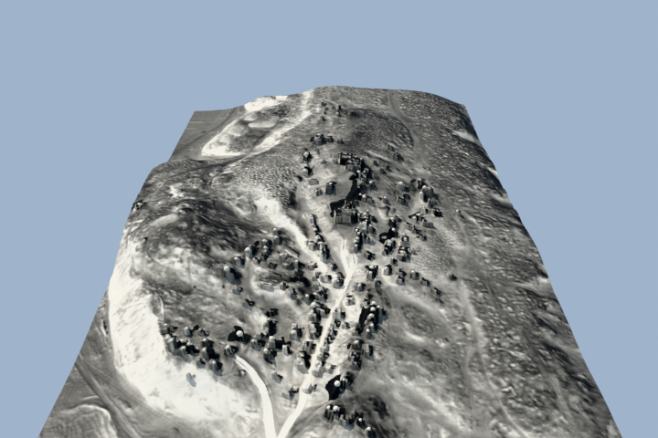
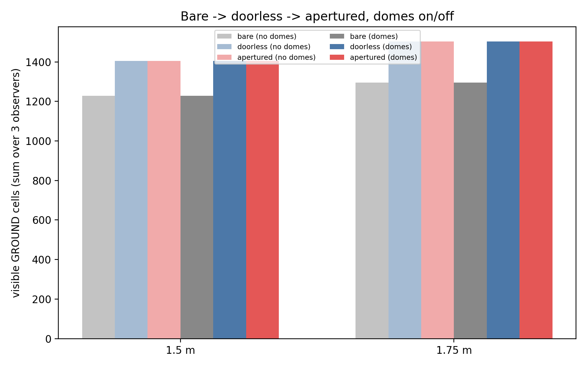

*GSoC 2026 · Late Antiquity Modeling Project (LAMP), HumanAI
Foundation · mentors Dr. Camille Leon Angelo (University of Alabama)
and Dr. Joshua Silver (Karlsruhe Institute of Technology) · research
facilitated by the REL Digital Lab, Department of Religious Studies,
University of Alabama*

By Romit Basak

*El Bagawat, Kharga Oasis, Egypt. Photo: Ktiv, [CC BY-SA
4.0](https://creativecommons.org/licenses/by-sa/4.0/), via Wikimedia
Commons.*

Standard GIS viewsheds treat every building as a solid, opaque block.
This project rectifies this limitation. The script I built casts rays
through a real 3D scene with modelled doors and windows, creating new
possibilities for exploring the relationship between the landscape and
the structures that populated it.

## The site and the question

El Bagawat is a necropolis comprising roughly 263 mudbrick chapels
constructed on the sandy hills of Egypt's Western Desert, built between
the 3rd and 7th centuries CE. The Late Antiquity Modeling Project's
(LAMP) interest in the site is both architectural and social: what did
a person standing anywhere in this landscape actually see, and how did
that shape Christian use of particular buildings?

Answering that requires a *viewshed* — a simulation of what someone can
see from a given point. Existing tools can compute one. The trouble is
what they leave out.

## The problem with standard tools

GIS viewshed analysis — GRASS `r.viewshed`, 2D space-syntax visibility
graphs — is planimetric. Every building is a solid block with a
height, nothing more. That's a reasonable simplification for a lot of
terrain analysis, but it obscures important nuances: namely, how
doorways and windows let sight and light pass *through* a structure
and *between* structures, not just around them.

A necropolis of individually built, inconsistently oriented mausolea,
on sloped and irregular ground, is close to a worst case for that
simplification. The direction of a mausoleum's entrance matters. If a
model can't represent an aperture, then it can't accurately represent
the visual dimensions of a built environment.

## What I built

A true 3D ray-casting engine. Buildings get real height from the
difference between two digital elevation models — one with structures,
one without — rather than from an assumed constant or a separate
imagery source. Rays are cast from an observer's eye (default 1.5 m,
more accurately reflecting skeletal data for ancient populations
rather than the usual 1.75 m GIS default) through the resulting 3D
scene, checking first-hit geometry the same way a renderer would. This
script can also be customized to account for variances in the
visitor's head position, such as whether they are looking up or
straight ahead.

Before adding anything the site plan doesn't already have, the engine
had to earn trust on the plain case: it agrees with GRASS `r.viewshed`
at 97–99% cell-by-cell agreement on solid, unmodified buildings.
Anything that changes afterwards is coming from the openings, not from
a bug in the ray caster.

*The 3D scene the engine casts rays through — building geometry
extruded from the DEM differential, rendered here in Blender for
illustration. The ray-casting itself runs on this same geometry, not
on the render. Image: © The Late Antiquity Modeling Project 2026.*

## Finding the real doors

The incomplete nature of archaeological data made this project all the
more challenging. For example, locating building entrances was not an
easy feat. The obvious source for door positions would normally be the
site's top plan. However, because both entrances and incompletely
preserved walls are visualized with visible gaps in the linework,
computational tools could not differentiate between these two
features.

What worked instead was lower-tech: we used information provided in
the excavation report, which noted the entrance direction. The
entrance directions for 194 of 263 chapels were hand-validated against
a sample. Door widths and positions for a handful of chapels came from
CAD threshold marks in the surviving architectural drawings. Between
the two, the registry now holds 469 openings across 202 buildings,
including 197 doors and 93 windows.

Adding openings to a validated, solid baseline and re-running the
site-wide comparison gives a clean decomposition:

| Variant | Ground Cells Visible | Interior-Visible Pairs |
|---|---|---|
| Solid buildings only | 36,520 | 8 |
| + Doors | 36,657 (+137) | **11** |
| + Windows | 37,858 (+1,201) | 11 (+0) |
| + Niches, apses | 37,858 (+0) | 11 (+0) |

In the case of this site's architecture, doors add comparatively
little ground area, but are the only opening that puts a building's
interior in view. Windows add roughly nine times more visible ground
and precisely zero new interiors. That's not a coincidence of this
site — it's forced by the geometry. A windowsill sits above standing
eye height, so a sightline through it has to rise before it can pass,
and it lands high on the far wall rather than reaching the floor. A
door spans floor level, so a sightline through it can go straight in.

<figure class="schematic" role="img" aria-label="Two side-by-side diagrams: a sightline through a door reaching the interior floor of a far wall, and a sightline through a window, whose sill sits above eye height, rising to strike a far wall well above the floor">

<svg viewBox="0 0 300 260" xmlns="http://www.w3.org/2000/svg">
  <line x1="10" y1="140" x2="290" y2="140" stroke="#e2e8f0" stroke-width="1" stroke-dasharray="2 4"/>
  <line x1="10" y1="220" x2="290" y2="220" stroke="#94a3b8" stroke-width="2"/>
  <rect x="110" y="64" width="16" height="156" fill="#334155"/>
  <rect x="110" y="104" width="16" height="116" fill="#ffffff" stroke="#0f172a" stroke-width="1"/>
  <rect x="230" y="64" width="16" height="156" fill="#334155"/>
  <circle cx="40" cy="140" r="6" fill="#0f172a"/>
  <line x1="40" y1="146" x2="40" y2="220" stroke="#0f172a" stroke-width="2"/>
  <text x="40" y="118" font-size="13" fill="#0f172a" text-anchor="middle">observer</text>
  <text x="40" y="160" font-size="11" fill="#64748b" text-anchor="middle">eye, 1.5 m</text>
  <text x="118" y="52" font-size="12" fill="#0f172a" text-anchor="middle">door</text>
  <line x1="40" y1="140" x2="238" y2="220" stroke="#f97316" stroke-width="2.5" stroke-dasharray="6 4"/>
  <circle cx="238" cy="220" r="3" fill="#f97316"/>
  <text x="150" y="244" font-size="12" fill="#b45309" text-anchor="middle">reaches the interior floor</text>
</svg>

Through a door

<svg viewBox="0 0 300 260" xmlns="http://www.w3.org/2000/svg">
  <line x1="10" y1="140" x2="290" y2="140" stroke="#e2e8f0" stroke-width="1" stroke-dasharray="2 4"/>
  <line x1="10" y1="220" x2="290" y2="220" stroke="#94a3b8" stroke-width="2"/>
  <rect x="110" y="64" width="16" height="156" fill="#334155"/>
  <rect x="110" y="90" width="16" height="35" fill="#ffffff" stroke="#0f172a" stroke-width="1"/>
  <rect x="230" y="64" width="16" height="156" fill="#334155"/>
  <circle cx="40" cy="140" r="6" fill="#0f172a"/>
  <line x1="40" y1="146" x2="40" y2="220" stroke="#0f172a" stroke-width="2"/>
  <text x="40" y="118" font-size="13" fill="#0f172a" text-anchor="middle">observer</text>
  <text x="40" y="160" font-size="11" fill="#64748b" text-anchor="middle">eye, 1.5 m</text>
  <text x="118" y="52" font-size="12" fill="#0f172a" text-anchor="middle">window</text>
  <line x1="126" y1="125" x2="142" y2="125" stroke="#64748b" stroke-width="1"/>
  <text x="146" y="129" font-size="10" fill="#64748b">sill</text>
  <line x1="40" y1="140" x2="238" y2="84" stroke="#0891b2" stroke-width="2.5" stroke-dasharray="6 4"/>
  <circle cx="238" cy="84" r="3" fill="#0891b2"/>
  <text x="150" y="244" font-size="12" fill="#0e7490" text-anchor="middle">hits the far wall high</text>
</svg>

Through a window

<figcaption>Why doors and windows do different jobs: a door spans floor
level, so a sightline through it can reach the interior. A window sill
sits above eye height, so the same geometry sends the sightline up and
into the far wall instead. Each panel is its own building — the two do
not share a wall.</figcaption>
</figure>

## Is the arrangement intentional?

The decomposition above says what a single doorway does. A separate
question is whether entrances across the *whole site* are arranged
with respect to each other — whether standing at one chapel's door
puts another chapel's interior in view more often than chance would
produce on this terrain, with this density of buildings.

Here is what our initial analysis suggests: a pre-registered Monte
Carlo test (α = 0.01, Holm-corrected, 999 draws) counts ordered
building pairs where one structure's interior is visible from a
standing position outside another's doorway. Against three nulls —
permuting which wall carries the door, permuting chapel positions, and
permuting both — the observed count of 377 such pairs is rejected
by all three: zero of 999 random draws in any null reached it.

**What does and doesn't this establish?** The nulls test whether the
arrangement is *random*, not *why* it isn't. Our initial results
suggest that the entrance arrangement is **non-random with respect to
something local**; 377 is the measurement, not yet the explanation of
what produced it. The Late Antiquity Modeling Project (LAMP) has a
hypothesis for what is driving this, and will explore that hunch more
in the next phases
of the project.

## Limits of the data available

The documentation for the site does not consistently provide both an
opening's position along its wall and its dimensions. The excavation
report sometimes states which wall has an entrance, but not a surveyed
position. Everywhere else, position and dimensions fall back to a
spacing rule and a class default. What's genuinely evidenced is
which wall an opening sits in — not exactly where along it.

There's also no measured visibility data to validate against because
we are working with archaeological reconstructions. Validation instead
requires corroborating and comparing with established tools, and
visual audit of outputs.

## Why this matters beyond one site

Archaeology, urban history, and architecture all lean on visibility to
explain human behavior. For too long, these fields have accepted
"buildings are solid blocks" as a limitation of the available tools. A
physically real, aperture-aware 3D approach removes that constraint.

The engine and pipeline are published so the method can be applied
elsewhere with appropriate credit.

---

**Code:** [github.com/romit-basak/LAMP-public](https://github.com/romit-basak/LAMP-public)

**Contact:** Romit Basak — [basak.r@northeastern.edu](mailto:basak.r@northeastern.edu)

**Project Co-PIs:** Dr. Camille Leon Angelo ([cgangelo@ua.edu](mailto:cgangelo@ua.edu)),
Dr. Joshua Silver ([joshua.silver@kit.edu](mailto:joshua.silver@kit.edu))
